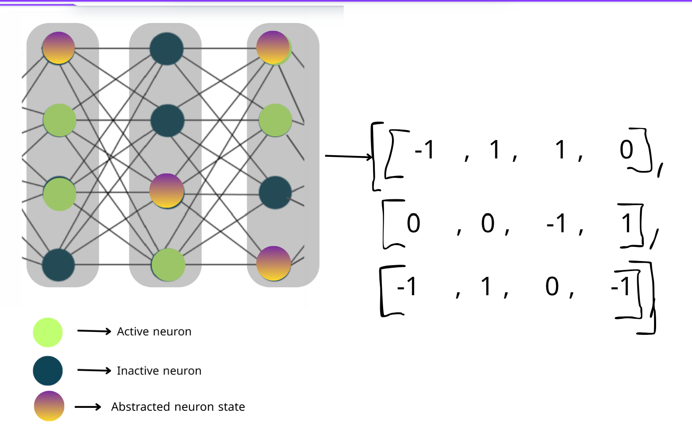

## Goal
Finding  **subset-minimal** sets of neuron-status literals whose fixation forces the model to keep the same decision in a region around the input.

**Formal statement:**

Given a ReLU network f, an input x₀ with class c = argmax_j f_j(x₀),
and a region R around x₀ (e.g., L∞ ball of radius ε),
find a set S of neuron-status literals such that:

1) For all x in R: argmax_j f_j(x ; statuses in S enforced) = c  
2) No strict subset of S also satisfies (1)

**Where:**
- **S** = set of literals (“active” or “inactive” status of specific ReLUs)
- **R** = region around x₀ (e.g., ‖x − x₀‖∞ ≤ ε)
- **c** = class predicted at x₀
### Method (oracle + iterative approach)
- `check(S)` uses a verifier (MILP/BaB) with status constraints on \(S\) and region constraints on \(R\).
- We start from the full Neural activation pattern of the input and greedily remove literals while preserving certification.
  

### 
- Minimality of  the explanation depends on the chosen traversal heuristic and is not guaranteed to be the minimal cardinality.


## Features

- **Neural Activation Extraction**  
  Extracting the internal neuron activations when the model performs inference on a given input.

- **Local Robust Region Identification**  
  Define the largest surrounding region (typically an ε-ball around the input) where the observed activation pattern guarantees the robustness of the model’s prediction.

- **Constraint Relaxation via Formal Verification**  
  Use a formal verifier (MILP / Branch-and-Bound) to selectively relax neuron activation constraints while preserving the robustness property in the region.

- **Neuron Constraint Prioritization**  
  Configure priority rules for which constraints to try dropping first (based on heuristics such as gradient magnitude, layer depth, or random order).
 Different heuristics lead to different minimal sets.

- **Timeout Configuration**  
  Specify a timeout for each verification call when attempting to drop a neuron constraint.
This avoids stalls on hard instances.

---

## Project Structure

```
root/
 ├── src/          # Source code
 ├── docs/         # Documentation
 ├── tests/        # Unit tests
 ├── data/         # Data files
 └── README.md     # This file
```

---

## Installation

### Prerequisites

- Language/Framework version
- Dependencies

### Steps

```bash
# Clone the repository
git clone https://github.com/something
cd project

# Install dependencies
pip install -r requirements.txt   # or npm install / gradle build etc.

# Run the script
python main.py
```

---

## Usage

```bash
# Example command to run
python main.py --option value
```

## Screenshots

Here is the homepage of the project:


demos

## Tests

```bash
pytest tests/    # or npm test / gradle test etc.
```

---

## Roadmap

- [ ] Feature A
- [ ] Feature B
- [ ] Feature C

---

## FAQ

- **Q** : Why do we only consider fully connected networks whith RELU activation functions ?  
  **R** : I will answer it later .

- **Q** : Can we really find the smallest set of neurons that define the explanation ?  
  **R** : I will answer it later and add more questions

## Contributing

1. Fork the project
2. Create your feature branch (`git checkout -b feature/foo`)
3. Commit your changes (`git commit -m 'Add foo'`)
4. Push to the branch (`git push origin feature/foo`)
5. Create a new Pull Request

---

## License

Distributed under the MIT License. See `LICENSE` for more information.

---

## Author(s)

- **Sarah** – [@username](https://github.com/SarahDribi)
